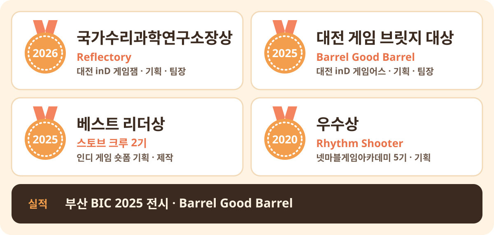
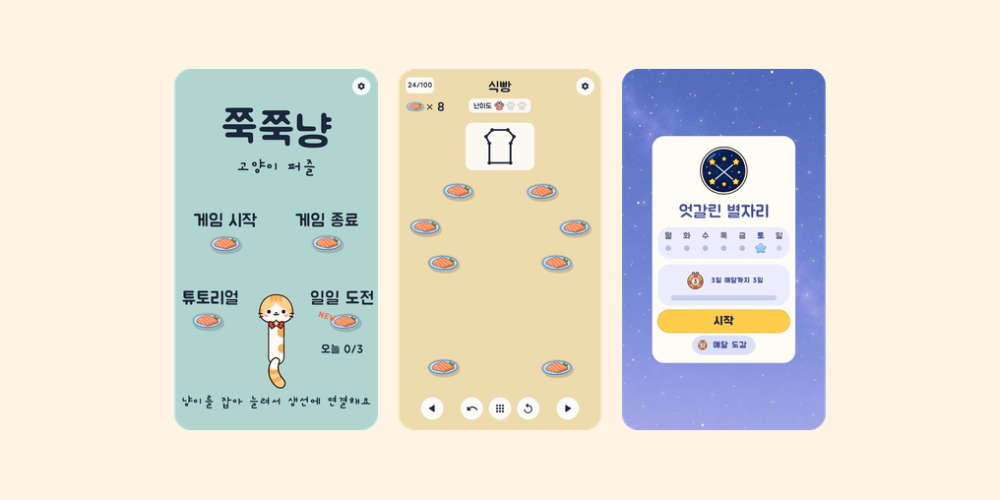

 

## 🏆 수상

 

## 🎮 Projects

<table>
  <tr>
    <td width="50%" valign="middle">
      
    </td>
    <td width="50%" valign="middle">
      <h2>Barrel Good Barrel</h2>
      <h3>🏅 대전 게임 브릿지 대상</h3>
      <h3>🎪 부산 BIC 2025 전시</h3>
      <h3>3인 팀 기획 · 팀장 · 7개월</h3>
      <h3><a href="https://minari-kr.itch.io/barrel-good-barrel">▶ 브라우저에서 플레이</a></h3>
    </td>
  </tr>
  <tr>
    <td width="50%" valign="middle">
      
    </td>
    <td width="50%" valign="middle">
      <h2>Reflectory</h2>
      <h3>🏅 국가수리과학연구소장상</h3>
      <h3>4인 팀 기획 · 팀장 · 3일 게임잼</h3>
      <h3><a href="https://minari-kr.itch.io/reflectory">▶ 브라우저에서 플레이</a></h3>
    </td>
  </tr>
  <tr>
    <td width="50%" valign="middle">
      
    </td>
    <td width="50%" valign="middle">
      <h2>쭉쭉냥</h2>
      <h3>📱 Android 비공개 테스트 중</h3>
      <h3>1인 개발 · 기획부터 출시 준비까지</h3>
    </td>
  </tr>
</table>
