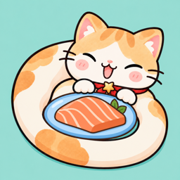
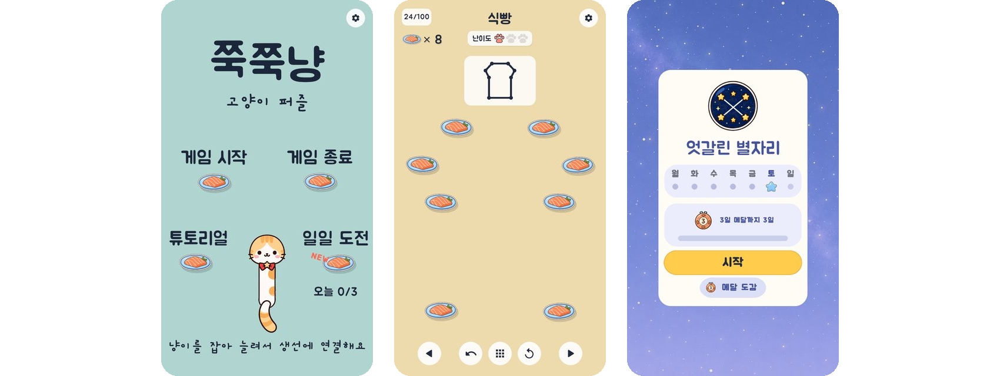
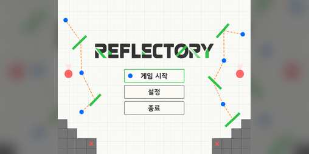
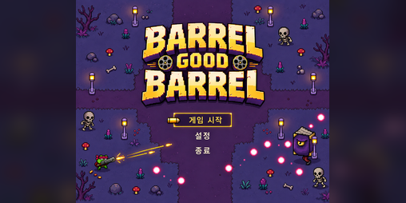

 

 

## 🐾 About

**게임 시스템 기획자 Minari**입니다.

- 팀 프로젝트 2개에서 **기획과 팀장**을 맡았습니다 (3일 게임잼, 7개월 장기 프로젝트).
- 개인 프로젝트 **쭉쭉냥**은 기획부터 개발, 스토어 출시 준비까지 혼자 하고 있습니다.
- 기획 의도를 **규칙과 숫자**로 정하고, 그대로 동작하는지 **직접 만든 도구와 자동 테스트**로 확인합니다. 아래 쭉쭉냥 표에 그 방법을 정리했습니다.

 

## 🎮 Projects

<table>
  <tr>
    <td colspan="2" align="center">
      
      <h3>🐱 쭉쭉냥 — 고양이 퍼즐</h3>
      <b>개인 프로젝트 · 2026 · 기획과 개발 전부</b>  
      쭉쭉 늘어나는 냥이를 연어 접시에 감아서, 견본 그림을 <b>한붓에</b> 그리는 퍼즐 
      레벨 100개 · 튜토리얼 4단계 · 매일 3문제 일일 도전 · 연속 기록 메달  
      
      
      
    </td>
  </tr>
  <tr>
    <td colspan="2" align="center">
      
    </td>
  </tr>
  <tr>
    <th width="38%" align="left">🎯 기획 의도</th>
    <th align="left">🔍 만든 방법과 확인 방법</th>
  </tr>
  <tr>
    <td valign="top">쉬운 레벨부터 천천히 오르고, 10판마다 한 번 확 어려운 <b>고비 레벨</b>이 오게</td>
    <td valign="top">그림만 보고 <b>난이도 점수</b>를 내는 식을 만들었습니다. 선 개수, 3갈래 이상 만나는 접시, 같은 접시를 다시 지나는 횟수, 꺾임과 교차, 막다른 길로 빠질 확률 등을 더합니다. 이 점수로 100개를 10판씩 정렬하고, 고비 레벨은 앞 9판 평균보다 <b>2.5점 이상</b> 높은 것으로 고릅니다.</td>
  </tr>
  <tr>
    <td valign="top">새 기술이 필요한 레벨보다 그 기술을 <b>알려 주는 레벨</b>이 먼저 나오게</td>
    <td valign="top">기술(교차, 같은 접시 다시 지나기, 갈림길 등)마다 힌트로 가르치는 레벨을 정해 두고, 정렬 스크립트가 그 레벨을 기술이 처음 필요한 레벨 앞으로 당깁니다. 고비 레벨도 기술을 배우기 전에는 나오지 않습니다.</td>
  </tr>
  <tr>
    <td valign="top">100개 레벨 모두 <b>반드시 풀 수 있게</b></td>
    <td valign="top">레벨마다 저장된 정답 순서를 게임 규칙 그대로 다시 그려 보는 자동 테스트를 돌립니다 (튜토리얼 포함). 전체 자동 테스트는 <b>879개</b>, 모두 통과합니다.</td>
  </tr>
  <tr>
    <td valign="top">서버 없이 <b>날짜만으로</b> 모두에게 같은 일일 도전 3문제</td>
    <td valign="top">날짜를 씨앗으로 문제를 만들고, 만든 문제마다 위와 같은 정답 풀이 검사를 거칩니다. 통과하지 못하면 기존 레벨을 뒤집어 대신 냅니다.</td>
  </tr>
  <tr>
    <td valign="top">막혀도 <b>답을 바로 주지 않고</b> 조금씩 돕게</td>
    <td valign="top">힌트가 그림 다시 보기 → 힌트 문장 → 시작 접시 표시 순서로 열립니다. 열리는 시간은 레벨의 난이도 점수에 맞춥니다.</td>
  </tr>
</table>

 

<table>
  <tr>
    <td width="50%" valign="top">
      
      <h3>🪞 Reflectory</h3>
      퍼즐 · 2026 대전 inD 게임잼 (3일) 
      4인 팀 <b>기획 · 팀장</b>  
      🏅 <b>국가수리과학연구장상</b>  
      <a href="https://minari-kr.itch.io/reflectory">▶ 브라우저에서 플레이</a>
    </td>
    <td width="50%" valign="top">
      
      <h3>🛢️ Barrel Good Barrel</h3>
      탑다운 슈팅 · 대전 인디(inD) 게임어스 (7개월) 
      3인 팀 <b>기획 · 팀장</b>  
      🏅 <b>2025 대전 게임 브릿지 대상</b> · 2025 부산 BIC 전시  
      <a href="https://minari-kr.itch.io/barrel-good-barrel">▶ 브라우저에서 플레이</a>
    </td>
  </tr>
</table>

 

## 🏆 Awards & Activities

<table>
  <tr>
    <th align="center" width="64">연도</th>
    <th align="left" width="190">활동</th>
    <th align="left">내용</th>
  </tr>
  <tr>
    <td align="center">2026</td>
    <td>대전&nbsp;inD&nbsp;게임잼</td>
    <td>Reflectory 기획·팀장 · 🏅 <b>국가수리과학연구장상</b></td>
  </tr>
  <tr>
    <td align="center">2025</td>
    <td>대전&nbsp;인디(inD)&nbsp;게임어스</td>
    <td>Barrel Good Barrel 7개월 개발 · 🏅 <b>대전 게임 브릿지 대상</b> · 부산 BIC 전시</td>
  </tr>
  <tr>
    <td align="center">2025</td>
    <td>스토브&nbsp;크루&nbsp;2기</td>
    <td>인디 게임 숏폼 콘텐츠 기획·제작 · 🏅 <b>베스트 리더상</b></td>
  </tr>
  <tr>
    <td align="center">2020</td>
    <td>넷마블게임아카데미&nbsp;5기</td>
    <td>Rhythm Shooter 기획 (ATM 팀) · 🏅 <b>우수상</b></td>
  </tr>
</table>

 

## 🛠️ Tools

  
  
  
  
  
  

 

🌏 Game system designer from Korea

